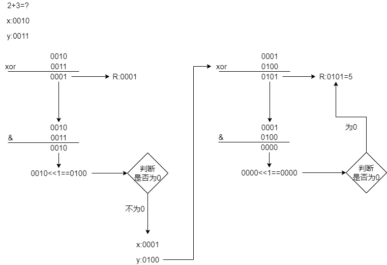
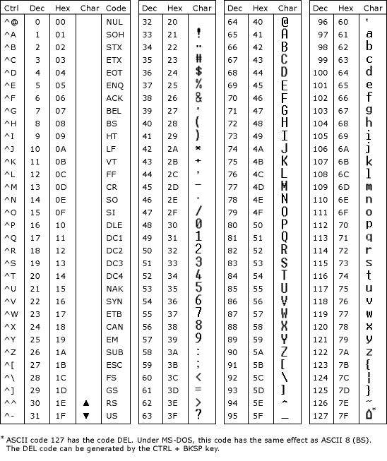

# 字符编码

> 注 : 笔记中拓扑图 drawio 源文件在其图片目录下

---

## 基本原理

**数据宽度**

数学上的数字可以无限大，但计算机中受硬件的制约，数据是有长度限制的。

4位宽度
- 0-F

8位宽度
- 00-FF

16位宽度
- 0000-FFFF

32位宽度
- 00000000-FFFFFFFF

**逻辑运算**

- 或(or |) 只要有一个为1就是1

  

- 与(and &) 两个都为1才是1

  

- 异或(xor ^) 不一样为1

  

- 非(not !) 1是0 0是1

  

- CPU计算2+3

  

**真值**

真值就是所表示数的大小,一般用10进制表示。

**机器数**

原码、补码、反码都是机器数的一种表示形式，或者说都属于机器数。

**原码**

原码的表示范围 - 127~-0, +0~+127, 共 256 个数字。

最高位为符号位,"0" 表示正,"1" 表示负,其余位表示数值的大小
```
X=+101011 , [X] 原 = 00101011    X=-101011 , [X] 原 = 10101011
```
位数不够的用 0 补全.

- 小数原码的定义
    ```
    X=+0.1011 , [X] 原 = 0.1011
    X=－0.1011 [X] 原 = 1.1011
    ```

**反码**

反码就是在原码的基础上,符号位不变其他位按位取反 (就是 0 变 1,1 变 0) 就可以了.
```
X=-101011 , [X] 原 = 10101011 ,[X] 反 = 11010100
```

**补码**

反码的基础上按照正常的加法运算加 1.
```
X=-101011 , [X] 原 = 10101011 ,[X] 反 = 11010100,[X] 补 =11010101
```
PS:0 的补码是唯一的,如果机器字长为 8 那么 [0] 补 = 00000000.


在计算机中，负数以其正值的补码形式表达。

**移码**

不管正负数,只要将其补码的符号位取反即可.
```
X=-101011 , [X] 原 = 10101011 ,[X] 反 = 11010100,[X] 补 = 11010101,[X] 移 = 01010101
```

**有符号数和无符号数**

在计算机中，可以区分正负的类型，称为有符类型（signed），无正负的类型（只有正值），称为无符类型。

当我们指定一个数量是无符号类型时，那么其最高位的1或0，和其它位一样，用来表示该数的大小。

当我们指定一个数量是无符号类型时，此时，最高数称为“符号位”。为1时，表示该数为负值，为0时表示为正值。

无符号数中，所有的位都用于直接表示该值的大小。有符号数中最高位用于表示正负，所以，当为正值时，该数的最大值就会变小。

无符号数
- 0~255
- 11111111 值：255
- 1* 27 + 1* 26 + 1* 25 + 1* 24 + 1* 23 + 1* 22 + 1* 21 + 1* 20

有符号数
- -128~127
- 01111111 值：127
- 1* 26 + 1* 25 + 1* 24 + 1* 23 + 1* 22 + 1* 21 + 1* 20

**大端存储和小端存储**

- https://www.ruanyifeng.com/blog/2022/06/endianness-analysis.html

大端存储与小端存储模式主要指的是数据在计算机中存储的两种字节优先顺序。

* 小端存储 : 高位字节放在高地址，低位字节存放在低地址。
* 大端存储 : 高位字节放在低地址，低位字节存放在高地址。

采用大端方式进行数据存放符合人类的正常思维，而采用小端方式进行数据存放利于计算机处理。


例如要表示 0x12345678

```
偏移地址:  0x 00   01   02   03
大端存储:     12   34   56   78
小端存储:     78   56   34   12
```

如果将一个16位的整数0x1234存放到一个短整型变量（short）中。这个短整型变量在内存中的存储在大小端模式由下表所示。
```
偏移地址:  0x 00   01
大端存储:     12   34
小端存储:     34   12
```

* 各自优点：
  * 小端存储 : 便于数据之间的类型转换，例如：long 类型转换为 int 类型时，高地址部分的数据可以直接截掉。
  * 大端存储 : 便于数据类型的符号判断，因为最低地址位数据即为符号位，可以直接判断数据的正负号。

* 用途：
  * 小端存储 : 常见于本地主机上(也有部分类型主机为大端存储)和 x86 平台。
  * 大端存储 : 常见于网络通信和 arm/移动平台上，网际协议 TCP/IP 在传输整型数据时一般使用大端存储模式表示,例如 TCP/IP 中表示端口和 IP 时，均采用的是大端存储

有的处理器系统采用了小端方式进行数据存放，如 Intel 的奔腾。有的处理器系统采用了大端方式进行数据存放，如 IBM 半导体和 Freescale 的 PowerPC 处理器。不仅对于处理器，一些外设的设计中也存在着使用大端或者小端进行数据存放的选择。

因此在一个处理器系统中，有可能存在大端和小端模式同时存在的现象。这一现象为系统的软硬件设计带来了不小的麻烦，这要求系统设计工程师，必须深入理解大端和小端模式的差别。大端与小端模式的差别体现在一个处理器的寄存器，指令集，系统总线等各个层次中。

---

## 运算符

`这里以 C 的常用运算符为例`

**算数运算**
```
+-*/    加、减、乘、除
%       取模运算    N=5,Y=N%3,Y=2
```

**逻辑运算**
```C
&&      逻辑与      A=TRUE,B=FALSE,C=A&&B,C=FALSE
||      逻辑或      A=TRUE,B=FALSE,C=A||B,C=TRUE
!       逻辑非      A=TRUE,B=!A,B=FALSE
```

**关系运算**
```C
>       大于        A=1,B=2,C=A>B,C=FALSE
<       小于        A=1,B=2,C=A<B,C=TRUE
>=      大于等于    A=2,B=2,C=A>=B,C=TRUE
<=      小于等于    A=2,B=2,C=A<=B,C=TRUE
==      等于        A=1,B=2,C=(A==B),C=FALSE
!=      不等于      A=1,B=2,C=(A!=B),C=TRUE
```

**位运算**
```C
<<      左移        A=0b00001111,A<<2=0b00111100
>>      右移        A=0b11110000,A>>2=0b00111100
&       按位与      A=0b1010,B=0b1000,A&B=0b1000
!       按位或      A=0b1010,B=0b1000,A!B=0b1010
~       按位取反     A=0b00001111,B=~A,B=0b11110000
^       按位异或    A=0b1010,B=0b1000,A^B=0b0010
```

**增量和减量运算**
```C
++      增量运算符  A=3,A++,A=4
--      减量运算符  A=3,A--,A=2
```

**复合赋值运算**
```C
+=      加法赋值    A=1,A+=2,A=3
-=      减法赋值    A=4,A-=4,A=0
>>=     右移位赋值  A=0b11110000,A>>=2,A=0b00111100
<<=     左移位赋值  A=0b00001111,A<<=2,A=0b00111100
*=      乘法赋值    A=2,A*=3,A=6
&=      按位与赋值  A=0b1010,A&=0b1000,A=0b1000
|=      按位或赋值  A=0b1010,A|=0b1000,A=0b1010
^=      按位异或赋值    A=0b1010,A^=0b1000,A=0b0010
%=      取模赋值    A=5,A%=2,A=1
/=      除法赋值    A=4,A/=2,A=2
```

**指针和地址运算**
```C
*       取内容  A=*P
&       取地址  A=&P
```

**输出格式转换**
```
0x      无符号十六进制数    0xa=0d10
0o      无符号八进制数      0o10=0d8
0b      无符号二进制数      0b10=0d2
0d      带符号十进制数      0d10000001=-127
0u      无符号十进制数      0u10000001=129
```

---

## 编码

> 更多内容可以参考 [Crypto 笔记](../../Security/Crypto/Crypto.md#常见编码)

计算机只记录 0 和 1,那文字该如何记录？事实上文本文件也是以 0 和 1 的形式来记录的,而通过编码系统的处理成为文字

所谓 `编码系统` 可以想象为一个 `字码对照表`


当写入文字数据时,该文字数据会有字码对照表将其转换为数字,再存入档案中.同样,当要读出数据时,也会经过字码对照表将数字转成对应的文字,再显示到屏幕上.所有当屏幕上出现乱码,你就要知道,这可能是字码对照表的问题.

常用的英文编码表为 `ASCII`,每个符合占 1bytes,因此有 256 种.

中文是 `big5`,每个中文字占用 2bytes,理论上最多有 65536 种,目前 `big5` 定义的中文还很少,很多中文是无法利用 `big5` 显示成功的.

不止中文字,其他非英语系国家也会有这样的问题

为了解决这种问题,ISO 制定了 `Unicode` 编码系统,所谓 `UTF-8` 或万国码

**相关文章**
- [UTF-8 遍地开花](http://utf8everywhere.org/zh-cn)
- [[BUG随想录] 看不见的分隔符: Zero-width space](https://www.cnblogs.com/SivilTaram/p/5767450.html)
- [一个特殊的字符？(%E2%80%8B)](https://blog.csdn.net/u014271114/article/details/55668115)
- [编码的故事](https://wenku.baidu.com/link?url=kTrscV5j5AsZq5zvBpr2jdkEJW8LqgrkkKsddwWA3YlXmgeqh_be95nMxqbFPOYoVBVy3A6lutlcXVDYLdZ-3iRawJpc0VZ71as07FnxtGS)
- [Unicode 和 UTF-8 是什么关系？本文为你解惑](https://mp.weixin.qq.com/s/6w0FYXN11wbuyj1IptAKEw)

---

### ASCII

在早期的计算机系统中，为了给字符编码，美国国家标准学会（American National Standard Institute：ANSI）制定了一套英文字母、数字和常用符号的编码，它占用一个字节，编码范围从 `0` 到 `127`，最高位始终为 `0`，称为 `ASCII` 编码。例如，字符'A'的编码是 `0x41`，字符'1'的编码是 `0x31`。

**表述方式**

`ASCII` 码使用指定的 7 位或 8 位二进制数组合来表示 128 或 256 种可能的字符.

标准 ASCII 码也叫基础 ASCII 码,使用 7 位二进制数 (剩下的 1 位二进制为 0) 来表示所有的大写和小写字母,数字 0 到 9、标点符号, 以及在美式英语中使用的特殊控制字符.其中:

- 0～31 及 127 (共 33 个)是控制字符或通信专用字符 (其余为可显示字符) ,如控制符:LF (换行) 、CR (回车) 、FF (换页) 、DEL (删除) 、BS (退格)、BEL (响铃) 等;通信专用字符:SOH (文头) 、EOT (文尾) 、ACK (确认) 等;ASCII 值为 8、9、10 和13 分别转换为退格、制表、换行和回车字符.它们并没有特定的图形显示,但会依不同的应用程序,而对文本显示有不同的影响.
- 32～126 (共 95 个)是字符( 32 是空格) ,其中 48～57 为 0 到 9 十个阿拉伯数字.
- 65～90 为 26 个大写英文字母,97～122 号为 26 个小写英文字母,其余为一些标点符号、运算符号等.

后 128 个称为扩展 `ASCII` 码.许多基于 x86 的系统都支持使用扩展 (或"高") `ASCII`.扩展 `ASCII` 码允许将每个字符的第 8 位用于确定附加的 128 个特殊符号字符、外来语字母和图形符号.

**标准表**



**转义字符**

所有的 ASCII 码都可以用 `\数字`（一般是8进制数字）来表示。而 C 中定义了一些字母前加 `\` 来表示常见的那些不能显示的 ASCII 字符，如`\0`,`\t`,`\n` 等，就称为转义字符，因为后面的字符，都不是它本来的 ASCII 字符意思了。

| 转义字符 | 意义                                 | ASCII码值（十进制） |
| -       | -                                   | - |
| `\a`      | 响铃(BEL)                           | 007 |
| `\b`      | 退格(BS) ，将当前位置移到前一列         | 008 |
| `\f`      | 换页(FF)，将当前位置移到下页开头        | 012 |
| `\n`      | 换行(LF) ，将当前位置移到下一行开头     | 010 |
| `\r`      | 回车(CR) ，将当前位置移到本行开头       | 013 |
| `\t`      | 水平制表(HT) （跳到下一个TAB位置）      | 009 |
| `\v`      | 垂直制表(VT)                          | 011 |
| `\\`      | 代表一个反斜线字符''\'                | 092 |
| `\'`      | 代表一个单引号（撇号）字符              | 039 |
| `\"`      | 代表一个双引号字符                    | 034 |
| `\?`      | 代表一个问号                          | 063 |
| `\0`      | 空字符(NUL)                         | 000 |
| `\ddd`    | 1到3位八进制数所代表的任意字符          | 三位八进制 |
| `\xhh`    | 十六进制所代表的任意字符                | 十六进制 |

---

### UNICODE

随着互联网的发展,各个国家基本上都有自己的本地编码 `ANSI` 编码.为此,系统要支持多过的本地编码,怎么办？引入代码页 code page,根据代码页号去查相应的字符集,`GBK` 的代码页就是 `CP936` (有细微差别,详细可以查看维基百科) .

如果要把汉字也纳入计算机编码，很显然一个字节是不够的。`GB2312` 标准使用两个字节表示一个汉字，其中第一个字节的最高位始终为 `1`，以便和 `ASCII` 编码区分开。例如，汉字'中'的 `GB2312` 编码是 `0xd6d0`。

类似的，日文有 `Shift_JIS` 编码，韩文有 `EUC-KR` 编码，这些编码因为标准不统一，同时使用，就会产生冲突。

为了统一全球所有语言的编码，全球统一码联盟发布了 `Unicode` 编码，它把世界上主要语言都纳入同一个编码，这样，中文、日文、韩文和其他语言就不会冲突。

`UNICODE` 就是要将所有的字符全部编码在一个字符集里面,比如 1-10000 编码简体中文,10001-20000 编码繁体中文,依次类推,这样就构成了 `UNICODE` 字符集.但是 `UNICODE` 字符集并没说要怎么编码,只是说某个数字代表某个字符,即之规定了数字到字符的的字典,但是没有规定在计算机中怎么编码.

---

### UCS/UTF

因为英文字符的 `Unicode` 编码高字节总是 00，包含大量英文的文本会浪费空间，所以，出现了 `UTF-8` 编码，它是一种变长编码，用来把固定长度的 `Unicode` 编码变成 1～4 字节的变长编码。通过 `UTF-8` 编码，英文字符`'A'`的 `UTF-8` 编码变为 `0x41`，正好和 `ASCII` 码一致，而中文'中'的 `UTF-8` 编码为 3 字节 `0xe4b8ad`。,常见的有 UTF-8,UTF-16 (UCS-2) ,UTF-32 (UCS-4) 编码.

`UTF-8` 编码的另一个好处是容错能力强。如果传输过程中某些字符出错，不会影响后续字符，因为 `UTF-8` 编码依靠高字节位来确定一个字符究竟是几个字节，它经常用来作为传输编码。

`UTF-8` 是类似 `GBK` 编码的一种编码,就是用多个字节编码计算出值然后查表,它可以是一个字节 (也就是兼容 `ASCII`) 表示一个字符,可以是两个、三个、四个或者更多个字节根据计算得到某个值,然后去查 `UNICODE` 表得到某个字符,这样就将所有字符进行了编码.

`UTF-16` 则至少是需要两个字节来表示,也就是说,可以由两个字节计算得到某个值,也可以是四个字节、六个字节、八个字节计算出值然后查表得到字符.

`UTF-32` 则至少是需要四个字节表示,以此类推.

---

### GBK

`GBK` 由 `GB2312` 扩展来的,`GB2312` 是最早的中文编码方式.

---

### Windows ANSI

`GBK`、B`ig5` 等编码就是 `ANSI` 编码,也叫本地码.`ANSI` 编码就是本地码的统称,就是在什么国家或地区就是什么编码.比如在中国的大陆地区就是 `GBK`,在中国台湾就是 `Big5`.

---

### BCD

BCD 码（Binary-Coded Decimal‎），用4位二进制数来表示1位十进制数中的 0~9 这10个数码，是一种二进制的数字编码形式，用二进制编码的十进制代码。BCD 码这种编码形式利用了四个位元来储存一个十进制的数码，使二进制和十进制之间的转换得以快捷的进行。这种编码技巧最常用于会计系统的设计里，因为会计制度经常需要对很长的数字串作准确的计算。相对于一般的浮点式记数法，采用 BCD 码，既可保存数值的精确度，又可免去使计算机作浮点运算时所耗费的时间。此外，对于其他需要高精确度的计算，BCD 编码亦很常用。

BCD 码也称二进码十进数，BCD 码可分为有权码和无权码两类。其中，常见的有权 BCD 码有8421码、2421码、5421码，无权 BCD 码有余3码、余3循环码、格雷码。

```
十进制数     8421码	    5421码	    2421码	    余3码	    余3循环码
0	        0000	    0000	    0000	    0011	    0010
1	        0001	    0001	    0001	    0100	    0110
2	        0010	    0010	    0010	    0101	    0111
3	        0011	    0011	    0011	    0110	    0101
4	        0100	    0100	    0100	    0111	    0100
5	        0101	    1000	    1011	    1000	    1100
6	        0110	    1001	    1100	    1001	    1101
7	        0111	    1010	    1101	    1010	    1111
8	        1000	    1011	    1110	    1011	    1110
9	        1001	    1100	    1111	    1100	    1010
```

---

### Gray code

格雷码（循环二进制单位距离码）是任意两个相邻数的代码只有一位二进制数不同的编码，它与奇偶校验码同属可靠性编码。

由贝尔实验室的 Frank Gray 在1940年提出，用于在 PCM（脉冲编码调变）方法传送讯号时防止出错，并于1953年三月十七日取得美国专利。格雷码是一个数列集合，相邻两数间只有一个位元改变，为无权数码，且格雷码的顺序不是唯一的。

数字0～7的编码比较如下：
```
0  　　 000    000
1  　　 001    001
2   　　011    010
3   　　010    011
4   　　110    100
5   　　111    101
6   　　101    110
7   　　100    111
```

**格雷码能避免讯号传送错误的原理**

传统的二进制系统例如数字 3 的表示法为 011，要切换为邻近的数字 4，也就是 100 时，装置中的三个位元都得要转换，因此于未完全转换的过程时装置会经历短暂的，010,001,101,110,111 等其中数种状态，也就是代表着2、1、5、6、7，因此此种数字编码方法于邻近数字转换时有比较大的误差可能范围。格雷码的发明即是用来将误差之可能性缩减至最小，编码的方式定义为每个邻近数字都只相差一个位元，因此也称为最小差异码，可以使装置做数字步进时只更动最少的位元数以提高稳定性。
