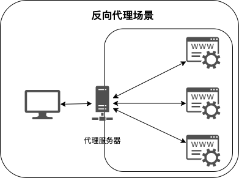

# 代理实验

> 注 : 笔记中拓扑图 xmind 源文件在其图片目录下

---

## 免责声明

`本文档仅供学习和研究使用,请勿使用文中的技术源码用于非法用途,任何人造成的任何负面影响,与本人无关.`

---

**相关文章**
- [终于有人把正向代理和反向代理解释的明明白白了！](https://cloud.tencent.com/developer/article/1418457)
- [谈谈我所了解的WEB代理](https://www.freebuf.com/articles/web/181723.html)
- [红队第9篇：给任意java程序挂Socks5代理方法](https://mp.weixin.qq.com/s/pVAZvKADFVwPOC4CwrCooQ)

**相关利用案例**
- [代理配置不当](../../Web安全/Web_Generic/Web_Generic.md#代理配置不当)

**相关资源**
- [zu1k/proxypool](https://github.com/zu1k/proxypool)

---

## 正向代理

正向代理（forward proxy）：是一个位于客户端和目标服务器之间的服务器(代理服务器)，为了从目标服务器取得内容，客户端向代理服务器发送一个请求并指定目标，然后代理服务器向目标服务器转交请求并将获得的内容返回给客户端。

这种代理其实在生活中是比较常见的，比如访问外国网站技术，其用到的就是代理技术。

有时候，用户想要访问某国外网站，该网站无法在国内直接访问，但是我们可以访问到一个代理服务器，这个代理服务器可以访问到这个国外网站。这样呢，用户对该国外网站的访问就需要通过代理服务器来转发请求，并且该代理服务器也会将请求的响应再返回给用户。这个上网的过程就是用到了正向代理。

所以，正向代理，其实是"代理服务器"代理了"客户端"，去和"目标服务器"进行交互。


#### proxifier

**官网地址**
- https://www.proxifier.com/

windows 下推荐

#### proxychains-ng

**项目地址**
- https://github.com/rofl0r/proxychains-ng

mac/linux 下推荐

可用 f8x 进行安装
```bahs
wget -O f8x https://f8x.io/
bash f8x -p
```

---

## 反向代理

反向代理（reverse proxy）：是指以代理服务器来接受 internet 上的连接请求，然后将请求转发给内部网络上的服务器，并将从服务器上得到的结果返回给 internet 上请求连接的客户端，此时代理服务器对外就表现为一个反向代理服务器。

对于常用的场景，就是在 Web 开发中用到的负载均衡服务器，客户端发送请求到负载均衡服务器上，负载均衡服务器再把请求转发给一台真正的服务器来执行，再把执行结果返回给客户端。



### nginx

**官网地址**
- https://www.nginx.com/

**安装方式**

linux 安装方式见如下链接🔗
- [nginx安装](../../../../Integrated/Linux/Power-Linux.md#nginx)

### frp

**简介**

frp 是一个专注于内网穿透的高性能的反向代理应用，支持 TCP、UDP、HTTP、HTTPS 等多种协议。可以将内网服务以安全、便捷的方式通过具有公网 IP 节点的中转暴露到公网。

**项目地址**
- https://github.com/fatedier/frp

**安装方式**

linux 配置方式见如下链接🔗
- [frp安装配置](../../../../Integrated/Linux/Power-Linux.md#frp)

**配置案例**
- https://gofrp.org/docs/examples/
- [配置frp内网穿透](https://www.feios.me/build-frp-server/)

**frp 实验 : 通过 SSH 访问内网机器**

- 公网 IP 的机器上(1.1.1.1)

    部署 frps，修改 frps.ini 文件，这里使用了最简化的配置，设置了 frp 服务器用户接收客户端连接的端口：
    ```ini
    [common]
    bind_port = 7000
    ```

    启动 frps

- 内网机器上(172.16.1.1)

    部署 frpc，修改 frpc.ini 文件
    ```ini
    [common]
    server_addr = 1.1.1.1
    server_port = 7000

    [ssh]
    type = tcp
    local_ip = 127.0.0.1
    local_port = 22
    remote_port = 6000
    ```
    local_ip 和 local_port 配置为本地需要暴露到公网的服务地址和端口。remote_port 表示在 frp 服务端监听的端口，访问此端口的流量将会被转发到本地服务对应的端口。

    启动 frpc

- 外部访问

    此时通过 SSH 访问内网机器 172.16.1.1，假设用户名为 test：
    ```
    ssh -oPort=6000 test@1.1.1.1
    ```

    frp 会将请求 1.1.1.1:6000 的流量转发到内网机器 172.16.1.1 的 22 端口

**frp 实验 : 通过 RDP 访问内网机器(STCP)**

- 公网 IP 的机器上(1.1.1.1)

    部署 frps，修改 frps.ini 文件
    ```ini
    [common]
    bind_port = 24880
    authentication_method = token
    token = token
    tls_only = true
    ```

    启动 frps
    ```
    ./frps -c frps.ini
    ```

- 内网机器上(172.16.1.1)

    部署 frpc，修改 frpc.ini 文件
    ```ini
    [common]
    server_addr = 1.1.1.1
    server_port = 24880
    authentication_method = token
    token = token
    tls_enable = true

    [frp]
    type = stcp
    sk = token
    local_ip = 127.0.0.1
    local_port = 3389
    # true 启用加密
    use_encryption = false
    # true 启用压缩
    use_compression = true
    ```

    启动 frpc
    ```
    ./frpc.exe -c frpc.ini
    ```

- 主力机器(192.168.1.1)

    部署 frpc，修改 frpc.ini 文件
    ```ini
    [common]
    server_addr = 1.1.1.1
    server_port = 24880
    authentication_method = token
    token = token
    tls_enable = true

    [frp_visitor]
    type = stcp
    # stcp 的访问者
    role = visitor
    # 要访问的 stcp 代理的名字
    server_name = frp
    # 只有 sk 一致的用户才能访问到此服务
    sk = token
    # 绑定本地端口用于访问 远程桌面 服务
    bind_addr = 127.0.0.1
    bind_port = 6000
    use_encryption = false
    use_compression = false
    ```

    启动 frpc
    ```
    ./frpc.exe -c frpc.ini
    ```

    rdp 127.0.0.1:6000

**frp 实验 : 映射本地 http 服务到公网 vps 上,并且绑 host www.test123.com**

- 公网 IP 的机器上(1.1.1.1)

    部署 frps，修改 frps.ini 文件
    ```ini
    [common]
    bind_port = 8080
    authentication_method = token
    token = token
    vhost_http_port = 80
    ```

    启动 frps
    ```
    ./frps -c frps.ini
    ```

- 内网机器上(172.16.1.1)

    部署 frpc，修改 frpc.ini 文件
    ```ini
    [common]
    server_addr = 1.1.1.1
    server_port = 8080
    token=token

    [web]
    type = http
    local_port = 80
    custom_domains = www.test123.com
    ```

    启动 frpc
    ```
    ./frpc.exe -c frpc.ini
    ```

- 测试

    ```
    curl http://1.1.1.1 -H "Host:www.test123.com"
    ```
